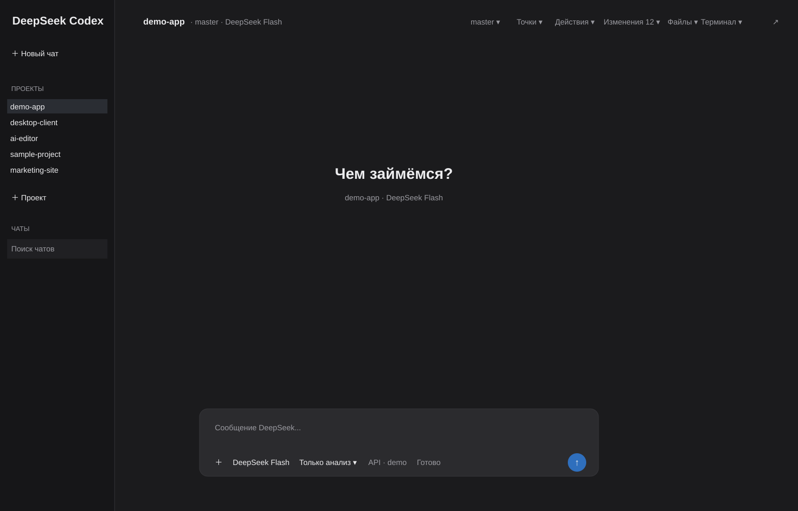

# DeepSeek Codex Desktop

A lightweight Windows desktop client for working with DeepSeek through a Codex-style project workflow.

> Unofficial community project. Not affiliated with OpenAI or DeepSeek.



DeepSeek Codex Desktop gives you a native desktop workspace for project-based AI coding without replacing your existing Codex installation. It uses a separate DeepSeek Codex profile and calls the installed Codex CLI under the hood.

## Highlights

- Native Windows desktop UI
- Project switching and per-project chat history
- Persistent Codex sessions
- DeepSeek Flash model workflow
- Edit mode and read-only analysis mode
- Git changes panel with diff preview
- Safe Git revert with confirmation
- Git branch switching and branch creation
- Built-in project file browser
- Built-in PowerShell terminal
- File attachments, drag & drop, and clipboard screenshots
- Project checkpoints with restore support
- Exact token usage from Codex JSONL events
- Pinned chats and full-content chat search
- Single-instance protection

## Quick setup for DeepSeek

DeepSeek publishes an official Codex setup script for Windows. This project keeps DeepSeek in a separate Codex profile so it does not replace your normal Codex configuration.

1. Install Codex CLI and launch it at least once:

```powershell
npm install -g @openai/codex
codex --version
```

2. In the same PowerShell window, point Codex at a separate profile:

```powershell
$env:CODEX_HOME="$env:USERPROFILE\.codex-deepseek"
New-Item -ItemType Directory -Force -Path $env:CODEX_HOME | Out-Null
```

3. Run DeepSeek's official Windows setup script:

```powershell
irm https://cdn.deepseek.com/api-docs/codex-deepseek-setup-en.ps1 | iex
```

4. Follow the setup menu and enter your own DeepSeek API key when prompted.

5. Start DeepSeek Codex Desktop. By default it reads the isolated profile from:

```text
%USERPROFILE%\.codex-deepseek
```

Your API key stays in your local Codex/DeepSeek configuration and is never bundled into this repository or the Windows release.

Official DeepSeek guide: https://api-docs.deepseek.com/quick_start/agent_integrations/codex/

## Requirements

- Windows 10 or Windows 11
- Python 3.11+ for running from source
- Node.js/npm
- Git
- Codex CLI installed globally
- A working DeepSeek Codex profile in `%USERPROFILE%\.codex-deepseek`

The app does **not** contain or ship your DeepSeek API key.

## Install Codex CLI

```powershell
npm install -g @openai/codex
```

Configure your DeepSeek Codex profile separately before starting the app. This repository intentionally does not include API keys, personal config files, state files, chat history, or checkpoints.

## Run from source

```powershell
git clone https://github.com/denisbogdanov354-ctrl/deepseek-codex-desktop.git
cd deepseek-codex-desktop
python -m pip install -r requirements.txt
python app.py
```

## Build the Windows app

```powershell
.\build.ps1
```

The resulting app is created at:

```text
dist\DeepSeek Codex\DeepSeek Codex.exe
```

## Configuration

By default, the app uses:

```text
DeepSeek profile: %USERPROFILE%\.codex-deepseek
Projects root:    %USERPROFILE%\Documents
```

You can override both without modifying the source:

```powershell
$env:DEEPSEEK_CODEX_HOME="D:\Profiles\.codex-deepseek"
$env:DEEPSEEK_CODEX_PROJECTS_ROOT="D:\Projects"
python app.py
```

The app looks for `codex.cmd`, `codex.exe`, or `codex` in PATH and falls back to the standard npm global installation path on Windows.

## Safety notes

- Read-only analysis mode runs Codex with a read-only sandbox.
- Git revert always requires confirmation.
- Untracked files are never silently deleted by Git revert.
- Project checkpoint restore requires confirmation and creates a safety checkpoint first.
- Checkpoints exclude common generated folders and files larger than 25 MB.
- Only one application instance is allowed at a time to protect the shared state file.

## Privacy

Local app state is stored outside the repository in the configured DeepSeek Codex profile directory. The public repository contains no user chat history, API keys, project files, or checkpoints.

## Status

Current release line: **1.0.x**

The application is Windows-first and currently built with Tkinter + tkinterdnd2.

## License

MIT. See [LICENSE](LICENSE).
